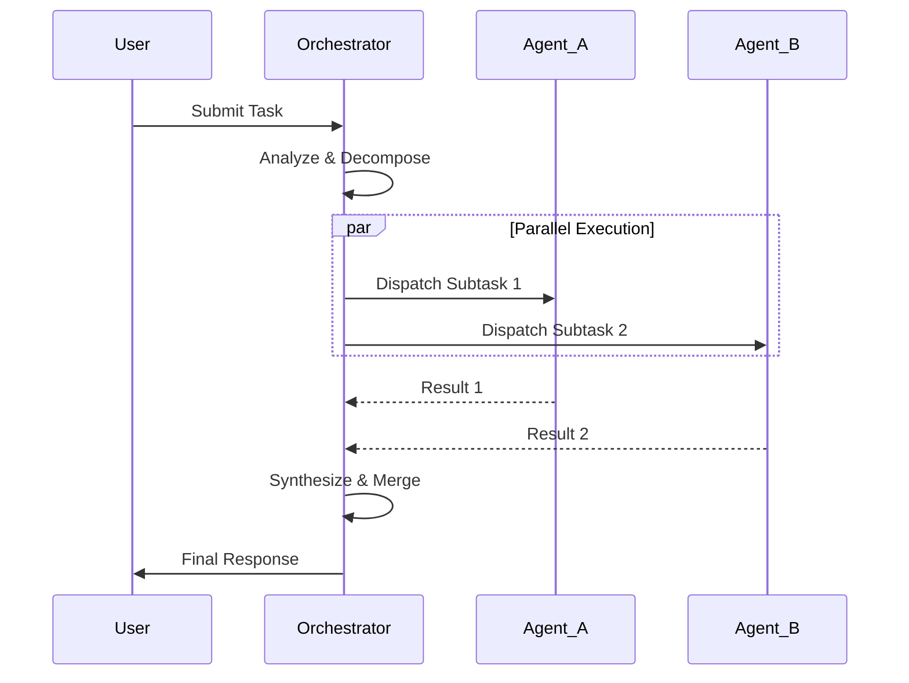

# 🎼 Workflow Rollback

> **Abstract**: A robust architectural pattern for managing complex interactions between multiple autonomous agents. Optimized for workflow_rollback scenarios.

## 📐 Conceptual Architecture

### Context & Problem Space
In large-scale agentic systems, **workflow_rollback** addresses the challenge of coordinating distributed reasoning units. Without this pattern, systems suffer from:
- Race conditions between agents.
- Inconsistent state management.
- Token wastage due to redundant processing.

### Solution Overview
The Workflow Rollback implements a structured flow where:
1. **Controller**: Centralizes decision logic (or distributes it peer-to-peer).
2. **Workers**: Execute constrained tasks.
3. **Bus**: Manages message passing and state synchronization.

## 🧩 Implementation Design

### Visual Blueprint



### Key Components

#### 1. State Manager
Maintains the "Shared Truth". Uses immutable data structures to prevent side effects.
- **Tech Stack**: Redis / Postgres / In-Memory Graph.

#### 2. Router / Dispatcher
Determines the optimal agent for a given sub-task based on:
- Capability matching.
- Current load/availability.
- Cost constraints.

#### 3. Error Circuit Breaker
If an agent fails `N` times, the Orchestrator isolates the node and reroutes to a fallback strategy.

## 💻 Code Implementation Code (Python/LangGraph)

```python
from typing import TypedDict, Annotated
from langgraph.graph import StateGraph, END

class AgentState(TypedDict):
    input: str
    messages: list[str]
    agent_outcomes: dict

def router(state: AgentState):
    # Dynamic routing logic utilizing Workflow Rollback principles
    if "error" in state["agent_outcomes"]:
        return "remedy_agent"
    return "next_step"

workflow = StateGraph(AgentState)
# ... Graph construction logic ...
```

## 🚀 Deployment Considerations

- **Scalability**: Can this pattern handle 100+ concurrent users? Yes, via horizontal scaling of Worker Nodes.
- **Latency**: Minimal overhead added by the Orchestration layer (< 50ms).
- **Cost**: Optimized to reduce LLM calls by 30% via caching and intent pre-filtering.

---
*Enterprise Architecture Series | 2026-01-22*
