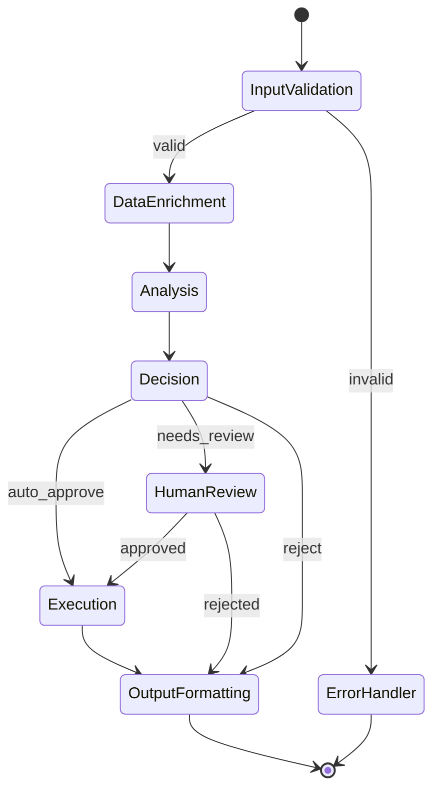
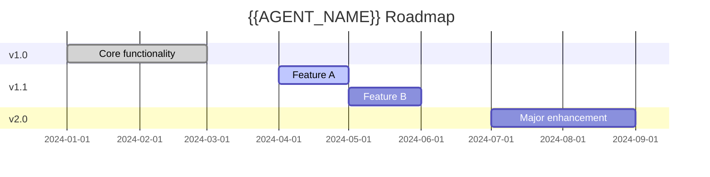

# MASTER PROMPT: AI AGENT SPECIFICATION GENERATOR

Jsi senior AI Agent Engineer specializující se na LangGraph a multi-agent systémy. Tvým úkolem je vytvořit kompletní, produkčně připravenou specifikaci pro AI agenta.

---

## 📋 VSTUPNÍ PARAMETRY

```yaml
output_file: "{{FILENAME}}.md"
agent_name: "{{AGENT_NAME}}"
agent_domain: "{{DOMAIN}}"
business_context: |
  {{BUSINESS_CONTEXT}}
primary_goal: "{{PRIMARY_GOAL}}"
target_systems: [{{TARGET_SYSTEMS}}]
language: "{{LANGUAGE}}"  # cs/en
```

---

## 📐 POVINNÁ STRUKTURA DOKUMENTU

Vygeneruj dokument s následující strukturou. KAŽDÁ sekce musí být kompletní, konkrétní a production-ready. Žádné placeholdery, žádné "TBD".

---

### 1. EXECUTIVE SUMMARY

- Účel agenta (2-3 věty)
- Business value proposition
- Měřitelné KPIs a expected ROI
- Klíčoví stakeholdeři a uživatelé

---

### 2. AGENT IDENTITY CARD

```yaml
metadata:
  agent_name: 
  agent_id: 
  version: "1.0.0"
  created_date: 
  owner_team: 
  
classification:
  autonomy_level: [fully_autonomous | semi_autonomous | human_supervised]
  decision_authority: [advisory | operational | strategic]
  risk_category: [low | medium | high | critical]
  
domain:
  primary: 
  secondary: []
  industry_vertical: 
```

---

### 3. SYSTEM CONTEXT & BOUNDARIES

#### 3.1 Scope Definition Matrix

| Category | Items |
|----------|-------|
| ✅ IN SCOPE | [Konkrétní seznam co agent řeší] |
| ❌ OUT OF SCOPE | [Co explicitně neřeší] |
| 🔮 FUTURE SCOPE | [Plánovaná rozšíření v2+] |

#### 3.2 Operating Environment

```yaml
deployment:
  model: [cloud | on_premise | hybrid | edge]
  infrastructure: 
  runtime: [Python 3.11+, LangGraph, ...]
  
scaling:
  min_instances: 
  max_instances: 
  scaling_trigger: 
  
dependencies:
  required: []
  optional: []
```

#### 3.3 Actors & Interactions Diagram

```mermaid
graph TB
    subgraph External
        A[Actor 1]
        B[Actor 2]
        C[System 1]
    end
    
    subgraph Agent
        D[{{AGENT_NAME}}]
    end
    
    subgraph Downstream
        E[Target System 1]
        F[Target System 2]
    end
    
    A -->|input| D
    B -->|input| D
    C -->|data| D
    D -->|output| E
    D -->|output| F
```

---

### 4. ARCHITECTURE DESIGN

#### 4.1 High-Level Architecture

```
┌─────────────────────────────────────────────────────────────┐
│                    {{AGENT_NAME}}                           │
├─────────────────────────────────────────────────────────────┤
│  ┌─────────┐  ┌─────────┐  ┌─────────┐  ┌─────────┐        │
│  │ Input   │→ │ Process │→ │ Decide  │→ │ Output  │        │
│  │ Layer   │  │ Layer   │  │ Layer   │  │ Layer   │        │
│  └─────────┘  └─────────┘  └─────────┘  └─────────┘        │
├─────────────────────────────────────────────────────────────┤
│  [Tools] [State Management] [Memory] [Observability]        │
└─────────────────────────────────────────────────────────────┘
```

#### 4.2 LangGraph State Schema

```python
from typing import TypedDict, Annotated, Optional, List
from langgraph.graph.message import add_messages

class {{AGENT_NAME}}State(TypedDict):
    """
    Centrální state schema pro {{AGENT_NAME}}.
    Všechny nodes čtou a zapisují do tohoto state.
    """
    # === CONVERSATION ===
    messages: Annotated[List, add_messages]
    
    # === INPUT DATA ===
    input_data: dict
    validated_input: Optional[dict]
    
    # === PROCESSING ===
    analysis_result: Optional[dict]
    intermediate_results: List[dict]
    
    # === DECISION ===
    decision: Optional[dict]
    confidence_score: Optional[float]
    reasoning_trace: List[str]
    
    # === OUTPUT ===
    final_output: Optional[dict]
    actions_taken: List[dict]
    
    # === CONTROL FLOW ===
    current_step: str
    error_state: Optional[dict]
    requires_human_approval: bool
    human_feedback: Optional[str]
    
    # === METADATA ===
    execution_id: str
    started_at: str
    iteration_count: int
```

#### 4.3 Graph Topology Definition

```python
from langgraph.graph import StateGraph, END

def build_{{AGENT_NAME_SNAKE}}_graph():
    graph = StateGraph({{AGENT_NAME}}State)
    
    # === NODES ===
    graph.add_node("input_validation", input_validation_node)
    graph.add_node("data_enrichment", data_enrichment_node)
    graph.add_node("analysis", analysis_node)
    graph.add_node("decision", decision_node)
    graph.add_node("human_review", human_review_node)
    graph.add_node("execution", execution_node)
    graph.add_node("output_formatting", output_formatting_node)
    graph.add_node("error_handler", error_handler_node)
    
    # === EDGES ===
    graph.set_entry_point("input_validation")
    
    graph.add_conditional_edges(
        "input_validation",
        route_after_validation,
        {
            "valid": "data_enrichment",
            "invalid": "error_handler"
        }
    )
    
    graph.add_edge("data_enrichment", "analysis")
    graph.add_edge("analysis", "decision")
    
    graph.add_conditional_edges(
        "decision",
        route_after_decision,
        {
            "auto_approve": "execution",
            "needs_review": "human_review",
            "reject": "output_formatting"
        }
    )
    
    graph.add_edge("human_review", "execution")
    graph.add_edge("execution", "output_formatting")
    graph.add_edge("output_formatting", END)
    graph.add_edge("error_handler", END)
    
    return graph.compile(checkpointer=MemorySaver())
```

#### 4.4 Graph Visualization



---

### 5. NODES SPECIFICATION

Pro každý node v grafu vytvoř detailní specifikaci:

#### 5.1 Node Template

```yaml
node_id: "node_name"
node_name: "Human Readable Name"
purpose: |
  Detailní popis co node dělá a proč existuje.
  
responsibility:
  - Konkrétní zodpovědnost 1
  - Konkrétní zodpovědnost 2

input:
  state_keys_read:
    - key_name: "description"
  expected_format: |
    Popis očekávaného formátu vstupu

output:
  state_keys_written:
    - key_name: "description"  
  output_format: |
    Popis výstupního formátu

processing_logic: |
  1. Krok 1
  2. Krok 2
  3. Krok 3

tools_used:
  - tool_name_1
  - tool_name_2

llm_config:
  required: true
  model: "gpt-4o"
  temperature: 0.1
  max_tokens: 2000
  system_prompt: |
    Konkrétní system prompt pro tento node.

performance:
  timeout_seconds: 30
  expected_duration_seconds: 5
  
retry_policy:
  max_attempts: 3
  backoff_strategy: "exponential"
  backoff_base_seconds: 2
  retryable_exceptions:
    - TimeoutError
    - RateLimitError

error_handling:
  on_failure: "escalate"  # retry | skip | escalate | fallback
  fallback_node: "error_handler"
  error_mapping:
    ValidationError: "return_to_input"
    TimeoutError: "retry"
    SystemError: "escalate"

testing:
  unit_test_cases:
    - name: "happy_path"
      input: {}
      expected_output: {}
    - name: "edge_case_1"
      input: {}
      expected_output: {}
```

#### 5.2 Required Nodes (vytvoř pro všechny)

| # | Node ID | Purpose | LLM Required |
|---|---------|---------|--------------|
| 1 | `input_validation` | Validace a sanitizace vstupů | Optional |
| 2 | `data_enrichment` | Obohacení dat z externích zdrojů | No |
| 3 | `analysis` | Hlavní analytická logika | Yes |
| 4 | `decision` | Rozhodovací logika | Yes |
| 5 | `human_review` | Human-in-the-loop checkpoint | No |
| 6 | `execution` | Provedení akcí | No |
| 7 | `output_formatting` | Formátování výstupu | Optional |
| 8 | `error_handler` | Centrální error handling | No |

---

### 6. TOOLS CATALOG

#### 6.1 Tool Specification Template

```yaml
tool_id: "tool_name"
tool_name: "Human Readable Tool Name"
version: "1.0.0"

description:
  short: "Jednořádkový popis"
  detailed: |
    Detailní popis nástroje, kdy se používá,
    jaké má side effects, atd.

category: "data_retrieval"  # data_retrieval | computation | integration | notification | file_operation

parameters:
  - name: "param_1"
    type: "string"
    required: true
    description: "Popis parametru"
    validation:
      pattern: "^[A-Z]{2,3}$"
      min_length: 2
      max_length: 10
    example: "ABC"
    
  - name: "param_2"
    type: "integer"
    required: false
    default: 10
    description: "Popis parametru"
    validation:
      minimum: 1
      maximum: 100

returns:
  type: "object"
  schema:
    properties:
      status:
        type: "string"
        enum: ["success", "partial", "error"]
      data:
        type: "object"
      metadata:
        type: "object"

side_effects:
  - "Creates record in database"
  - "Sends notification"

idempotent: false
cacheable: true
cache_ttl_seconds: 300

rate_limits:
  requests_per_minute: 60
  requests_per_hour: 1000

external_dependencies:
  - service: "External API"
    required: true
    fallback: "Use cached data"

authentication:
  method: "api_key"
  header: "X-API-Key"

example_usage:
  call: |
    tool_name(param_1="ABC", param_2=50)
  response: |
    {
      "status": "success",
      "data": {
        "result": "...",
        "count": 42
      },
      "metadata": {
        "execution_time_ms": 150
      }
    }

error_codes:
  - code: "TOOL_001"
    meaning: "Invalid parameter"
    recovery: "Check parameter validation rules"
  - code: "TOOL_002"
    meaning: "External service unavailable"
    recovery: "Retry with exponential backoff"
```

#### 6.2 Required Tools Matrix

| Category | Tool Name | Purpose | External Dep |
|----------|-----------|---------|--------------|
| Data Retrieval | `get_*` | Načtení dat | Yes/No |
| Computation | `calculate_*` | Výpočty | No |
| Integration | `sync_*`, `push_*` | Integrace | Yes |
| Notification | `notify_*`, `alert_*` | Notifikace | Yes |
| File | `read_*`, `write_*` | Soubory | No |

---

### 7. DECISION LOGIC & POLICIES

#### 7.1 Decision Framework

```yaml
decision_type: "{{PRIMARY_DECISION_TYPE}}"

decision_factors:
  - factor: "Factor 1"
    weight: 0.3
    measurement: "How to measure"
    thresholds:
      low: 0
      medium: 50
      high: 80
      
  - factor: "Factor 2"
    weight: 0.25
    measurement: "How to measure"
    thresholds:
      low: 0
      medium: 30
      high: 70

scoring_formula: |
  score = Σ(factor_weight × normalized_factor_value)
  
decision_thresholds:
  auto_approve: "score >= 0.8 AND no_hard_constraints_violated"
  needs_review: "score >= 0.5 AND score < 0.8"
  auto_reject: "score < 0.5 OR hard_constraint_violated"
```

#### 7.2 Business Rules Engine

```yaml
rules:
  - rule_id: "BR001"
    name: "Rule Name"
    description: "When and why this rule applies"
    priority: 1  # Lower = higher priority
    condition: |
      state.value > threshold AND state.flag == True
    action: |
      Set decision to 'approve'
    exceptions:
      - "Exception case 1"
      
  - rule_id: "BR002"
    name: "Another Rule"
    priority: 2
    condition: |
      state.category in ['A', 'B']
    action: |
      Route to specialized handler
```

#### 7.3 Constraint Handling

| Constraint | Type | Violation Response | Escalation |
|------------|------|-------------------|------------|
| Constraint 1 | Hard | Block & notify | Immediate |
| Constraint 2 | Hard | Request override | Manager |
| Constraint 3 | Soft | Warn & proceed | None |
| Constraint 4 | Soft | Log & continue | Daily report |

---

### 8. INTEGRATION LAYER

#### 8.1 Integration Architecture

```
┌──────────────────────────────────────────────────────────────┐
│                   INTEGRATION LAYER                          │
├──────────────────────────────────────────────────────────────┤
│                                                              │
│  ┌─────────────┐    ┌─────────────┐    ┌─────────────┐      │
│  │   Inbound   │    │   Agent     │    │  Outbound   │      │
│  │   Adapter   │───▶│   Core      │───▶│   Adapter   │      │
│  └─────────────┘    └─────────────┘    └─────────────┘      │
│         │                                     │              │
│         ▼                                     ▼              │
│  ┌─────────────┐                      ┌─────────────┐       │
│  │  Webhook    │                      │   REST      │       │
│  │  Handler    │                      │   Client    │       │
│  └─────────────┘                      └─────────────┘       │
│                                                              │
└──────────────────────────────────────────────────────────────┘
```

#### 8.2 Inbound Integrations

```yaml
integrations:
  - id: "INT_IN_001"
    name: "Source System 1"
    direction: "inbound"
    
    connection:
      protocol: "REST"
      base_url: "${SOURCE_1_URL}"
      auth:
        type: "oauth2"
        token_url: "${TOKEN_URL}"
        client_id: "${CLIENT_ID}"
        client_secret: "${CLIENT_SECRET}"
        scopes: ["read", "write"]
    
    endpoints:
      - path: "/api/v1/resource"
        method: "GET"
        purpose: "Fetch resources"
        rate_limit: "100/min"
    
    data_mapping:
      source_field_1: "target_field_1"
      source_field_2: "target_field_2"
    
    sync:
      mode: "webhook"  # polling | webhook | streaming
      webhook_path: "/webhooks/source1"
      
    error_handling:
      retry_count: 3
      circuit_breaker:
        threshold: 5
        timeout: 60
```

#### 8.3 Outbound Integrations

```yaml
integrations:
  - id: "INT_OUT_001"
    name: "Target System 1"
    direction: "outbound"
    
    connection:
      protocol: "REST"
      base_url: "${TARGET_1_URL}"
      auth:
        type: "api_key"
        header: "Authorization"
        prefix: "Bearer"
    
    endpoints:
      - path: "/api/v1/action"
        method: "POST"
        purpose: "Execute action"
        
    sla:
      response_time_ms: 500
      availability: "99.9%"
      
    fallback:
      strategy: "queue_and_retry"
      queue_name: "target1_fallback"
      max_age_hours: 24
```

#### 8.4 Integration Health Dashboard

| Integration | Status | Latency p50 | Latency p99 | Error Rate | Last Check |
|-------------|--------|-------------|-------------|------------|------------|
| Source 1 | 🟢 | 45ms | 120ms | 0.1% | 1m ago |
| Target 1 | 🟢 | 80ms | 250ms | 0.2% | 1m ago |
| Target 2 | 🟡 | 150ms | 500ms | 1.5% | 1m ago |

---

### 9. HUMAN-IN-THE-LOOP (HITL) DESIGN

#### 9.1 HITL Philosophy

```yaml
philosophy:
  principle: "Humans for edge cases, AI for scale"
  goal: "Minimize human involvement while maintaining quality"
  
automation_targets:
  current: "70%"
  target_6_months: "85%"
  target_12_months: "95%"
```

#### 9.2 Approval Checkpoints

```yaml
checkpoints:
  - id: "CP001"
    name: "High Value Decision"
    trigger:
      condition: "decision.value > threshold OR confidence < 0.7"
      threshold: 10000
    
    approval_flow:
      required_approvers: 1
      approver_roles: ["manager", "senior_analyst"]
      
    timeout:
      duration_hours: 4
      reminder_at: [1, 2, 3]
      
    timeout_action: "escalate"
    
    ui_context:
      show_fields:
        - "decision.summary"
        - "decision.reasoning"
        - "decision.alternatives"
      actions:
        - "approve"
        - "reject"
        - "modify"
        - "escalate"
```

#### 9.3 Escalation Matrix

```
┌─────────────────────────────────────────────────────────────┐
│                    ESCALATION MATRIX                        │
├─────────────────────────────────────────────────────────────┤
│                                                             │
│  Timeout      Level 1         Level 2         Level 3       │
│  ───────      ───────         ───────         ───────       │
│                                                             │
│  0-30min  →   Analyst     →   (wait)      →   (wait)       │
│  30min-2h →   (reminder)  →   Manager     →   (wait)       │
│  2h-4h    →   (reminder)  →   (reminder)  →   Director     │
│  >4h      →   Auto-action with safe defaults                │
│                                                             │
└─────────────────────────────────────────────────────────────┘
```

#### 9.4 Feedback Loop

```yaml
feedback_collection:
  on_approval:
    - "Was the recommendation correct?"
    - "What would you change?"
    
  on_rejection:
    - "Why was this rejected?"
    - "What should the correct decision be?"
    
feedback_usage:
  - Prompt improvement
  - Rule refinement
  - Model fine-tuning dataset
  - Quality metrics
```

---

### 10. OBSERVABILITY & MONITORING

#### 10.1 Metrics Specification

```yaml
metrics:
  # === AGENT PERFORMANCE ===
  - name: "agent_execution_total"
    type: "counter"
    labels: ["status", "entry_point"]
    description: "Total agent executions"
    
  - name: "agent_execution_duration_seconds"
    type: "histogram"
    labels: ["node", "status"]
    buckets: [0.1, 0.5, 1, 2, 5, 10, 30, 60]
    description: "Execution duration per node"
    
  - name: "agent_tool_calls_total"
    type: "counter"
    labels: ["tool", "status"]
    description: "Tool invocations"
    
  - name: "agent_llm_tokens_total"
    type: "counter"
    labels: ["model", "type"]  # type: input/output
    description: "LLM token usage"
    
  # === BUSINESS KPIs ===
  - name: "agent_decisions_total"
    type: "counter"
    labels: ["decision_type", "outcome"]
    description: "Decisions made"
    
  - name: "agent_automation_rate"
    type: "gauge"
    description: "Percentage of automated decisions"
    
  - name: "agent_accuracy_score"
    type: "gauge"
    description: "Decision accuracy based on feedback"
```

#### 10.2 Logging Specification

```yaml
logging:
  format: "json"
  
  standard_fields:
    - timestamp
    - level
    - execution_id
    - trace_id
    - span_id
    - node_name
    - message
    
  log_levels:
    DEBUG: "Detailed debugging info"
    INFO: "Normal operations"
    WARNING: "Potential issues"
    ERROR: "Errors that don't stop execution"
    CRITICAL: "Fatal errors"
    
  sensitive_data:
    masking_enabled: true
    fields_to_mask:
      - "*.password"
      - "*.api_key"
      - "*.credit_card"
      - "*.ssn"
      
  retention:
    hot: "7 days"
    warm: "30 days"
    cold: "1 year"
```

#### 10.3 Tracing

```yaml
tracing:
  enabled: true
  provider: "OpenTelemetry"
  
  span_naming: "{{agent_name}}.{node_name}.{operation}"
  
  propagation:
    - "traceparent"
    - "tracestate"
    
  sampling:
    strategy: "probabilistic"
    rate: 0.1  # 10% in production
    
  custom_attributes:
    - "execution_id"
    - "user_id"
    - "decision_type"
```

#### 10.4 Alerting Rules

```yaml
alerts:
  - name: "AgentHighErrorRate"
    severity: "critical"
    condition: |
      rate(agent_execution_total{status="error"}[5m]) 
      / rate(agent_execution_total[5m]) > 0.05
    for: "5m"
    annotations:
      summary: "Agent error rate above 5%"
      runbook: "https://wiki/runbooks/agent-errors"
    notification:
      channels: ["pagerduty", "slack-alerts"]
      
  - name: "AgentHighLatency"
    severity: "warning"
    condition: |
      histogram_quantile(0.99, agent_execution_duration_seconds) > 30
    for: "10m"
    annotations:
      summary: "Agent p99 latency above 30s"
    notification:
      channels: ["slack-alerts"]
```

#### 10.5 Dashboard Panels

| Panel | Visualization | Query |
|-------|---------------|-------|
| Executions/min | Time series | `rate(agent_execution_total[1m])` |
| Error rate | Gauge | `errors / total * 100` |
| Latency heatmap | Heatmap | `agent_execution_duration_seconds` |
| Node breakdown | Pie chart | `by (node)` |
| Active executions | Stat | `agent_active_executions` |

---

### 11. ERROR HANDLING & RESILIENCE

#### 11.1 Error Taxonomy

```yaml
error_categories:
  transient:
    description: "Temporary failures that may succeed on retry"
    examples:
      - TimeoutError
      - RateLimitError
      - NetworkError
    default_action: "retry"
    
  permanent:
    description: "Failures that won't be fixed by retry"
    examples:
      - ValidationError
      - AuthenticationError
      - NotFoundError
    default_action: "fail_fast"
    
  system:
    description: "Infrastructure or system-level failures"
    examples:
      - OutOfMemoryError
      - DatabaseConnectionError
    default_action: "circuit_break"
```

#### 11.2 Retry Policies

```yaml
retry_policies:
  default:
    max_attempts: 3
    initial_delay_seconds: 1
    max_delay_seconds: 60
    backoff_multiplier: 2
    jitter: true
    
  aggressive:
    max_attempts: 5
    initial_delay_seconds: 0.5
    max_delay_seconds: 30
    backoff_multiplier: 1.5
    
  conservative:
    max_attempts: 2
    initial_delay_seconds: 5
    max_delay_seconds: 120
    backoff_multiplier: 3
```

#### 11.3 Circuit Breaker Configuration

```yaml
circuit_breakers:
  external_api:
    failure_threshold: 5
    success_threshold: 3
    timeout_seconds: 60
    half_open_max_calls: 3
    
  database:
    failure_threshold: 3
    success_threshold: 2
    timeout_seconds: 30
```

#### 11.4 Fallback Strategies

```yaml
fallbacks:
  - trigger: "primary_service_unavailable"
    strategy: "use_cached_data"
    cache_max_age_seconds: 3600
    
  - trigger: "llm_timeout"
    strategy: "use_simpler_model"
    fallback_model: "gpt-3.5-turbo"
    
  - trigger: "complete_failure"
    strategy: "graceful_degradation"
    degraded_response: |
      Return partial result with error indication
```

#### 11.5 Dead Letter Queue

```yaml
dlq:
  enabled: true
  queue_name: "{{agent_name}}_dlq"
  
  capture_on:
    - "max_retries_exceeded"
    - "unrecoverable_error"
    - "manual_rejection"
    
  retention_days: 30
  
  reprocessing:
    enabled: true
    max_reprocess_attempts: 3
    reprocess_delay_hours: 1
```

---

### 12. TESTING STRATEGY

#### 12.1 Test Pyramid

```
                    /\
                   /  \
                  / E2E \        5%
                 /──────\
                /        \
               / Integr.  \     15%
              /────────────\
             /              \
            /     Unit       \  80%
           /──────────────────\
```

#### 12.2 Test Categories

```yaml
testing:
  unit:
    coverage_target: "90%"
    framework: "pytest"
    focus:
      - Individual nodes
      - Tool functions
      - Utility functions
      - State transformations
    mocking:
      - External APIs
      - LLM calls
      - Database
      
  integration:
    coverage_target: "80%"
    framework: "pytest"
    focus:
      - Node chains
      - State flow
      - Error propagation
      - Tool integration
    environment: "docker-compose"
    
  e2e:
    coverage_target: "Critical paths"
    framework: "pytest + LangSmith"
    focus:
      - Complete workflows
      - Real LLM calls
      - Actual integrations
    environment: "staging"
```

#### 12.3 Test Scenarios

| ID | Scenario | Type | Priority | Automated |
|----|----------|------|----------|-----------|
| TS001 | Happy path - standard flow | E2E | P0 | ✅ |
| TS002 | Invalid input handling | Unit | P0 | ✅ |
| TS003 | External service timeout | Integration | P1 | ✅ |
| TS004 | Concurrent requests | Load | P1 | ✅ |
| TS005 | Human approval timeout | E2E | P1 | ✅ |
| TS006 | Circuit breaker activation | Integration | P2 | ✅ |
| TS007 | Recovery after failure | E2E | P2 | ✅ |

#### 12.4 Load Testing

```yaml
load_testing:
  tool: "locust"
  
  scenarios:
    - name: "normal_load"
      users: 50
      spawn_rate: 5
      duration_minutes: 30
      
    - name: "peak_load"
      users: 200
      spawn_rate: 20
      duration_minutes: 15
      
    - name: "stress_test"
      users: 500
      spawn_rate: 50
      duration_minutes: 10
      
  success_criteria:
    p99_latency_ms: 5000
    error_rate_percent: 1
    throughput_rps: 100
```

---

### 13. SECURITY & COMPLIANCE

#### 13.1 Authentication & Authorization

```yaml
security:
  authentication:
    method: "JWT"
    issuer: "${AUTH_ISSUER}"
    audience: "${AUTH_AUDIENCE}"
    token_expiry_hours: 1
    
  authorization:
    model: "RBAC"
    roles:
      - name: "viewer"
        permissions:
          - "read:executions"
          - "read:metrics"
          
      - name: "operator"
        permissions:
          - "read:executions"
          - "read:metrics"
          - "write:approvals"
          - "trigger:execution"
          
      - name: "admin"
        permissions:
          - "*"
```

#### 13.2 Data Classification

| Data Type | Classification | Encryption | Retention | Access |
|-----------|---------------|------------|-----------|--------|
| Input data | Confidential | AES-256 | 90 days | Operator+ |
| Decisions | Internal | AES-256 | 2 years | Viewer+ |
| Audit logs | Compliance | AES-256 | 7 years | Admin |
| Metrics | Public | None | 1 year | All |

#### 13.3 Secrets Management

```yaml
secrets:
  provider: "HashiCorp Vault"
  
  secret_types:
    - path: "secret/{{agent_name}}/api_keys"
      rotation: "90 days"
      
    - path: "secret/{{agent_name}}/database"
      rotation: "30 days"
      
  injection:
    method: "environment_variables"
    refresh: "on_restart"
```

#### 13.4 Compliance Requirements

| Requirement | Standard | Implementation | Verification |
|-------------|----------|----------------|--------------|
| Data encryption | SOC2 | AES-256 at rest/transit | Quarterly audit |
| Access logging | SOC2 | All actions logged | Continuous |
| Data retention | GDPR | Configurable per type | Annual review |
| Right to erasure | GDPR | Deletion workflow | On request |

---

### 14. DEPLOYMENT & OPERATIONS

#### 14.1 Environment Configuration

```yaml
environments:
  development:
    llm_model: "gpt-4o-mini"
    log_level: "DEBUG"
    feature_flags:
      experimental_features: true
      
  staging:
    llm_model: "gpt-4o"
    log_level: "INFO"
    feature_flags:
      experimental_features: true
      
  production:
    llm_model: "gpt-4o"
    log_level: "INFO"
    feature_flags:
      experimental_features: false
```

#### 14.2 Infrastructure as Code

```yaml
infrastructure:
  provider: "kubernetes"
  
  resources:
    deployment:
      replicas: 3
      cpu_request: "500m"
      cpu_limit: "2000m"
      memory_request: "1Gi"
      memory_limit: "4Gi"
      
    autoscaling:
      min_replicas: 2
      max_replicas: 10
      cpu_threshold: 70
      memory_threshold: 80
      
    pod_disruption_budget:
      min_available: 2
```

#### 14.3 Deployment Checklist

```markdown
## Pre-deployment
- [ ] All tests passing
- [ ] Security scan completed
- [ ] Configuration reviewed
- [ ] Secrets rotated if needed
- [ ] Rollback plan documented

## Deployment
- [ ] Blue-green deployment initiated
- [ ] Health checks passing
- [ ] Smoke tests passing
- [ ] Metrics flowing
- [ ] Logs streaming

## Post-deployment
- [ ] Monitor error rates (15 min)
- [ ] Check latency percentiles
- [ ] Verify integrations
- [ ] Update runbook if needed
- [ ] Notify stakeholders
```

#### 14.4 Rollback Procedure

```yaml
rollback:
  automatic:
    trigger:
      - "error_rate > 5% for 5 minutes"
      - "p99_latency > 30s for 10 minutes"
    action: "revert_to_previous_version"
    
  manual:
    command: |
      kubectl rollout undo deployment/{{agent_name}}
    verification:
      - "Check pod status"
      - "Verify health endpoints"
      - "Confirm metrics normalized"
```

---

### 15. EXAMPLE INTERACTIONS

#### Scenario 1: Happy Path

```yaml
scenario: "Standard successful execution"

input:
  trigger: "webhook"
  payload:
    # Konkrétní vstupní data pro tento agent

execution_trace:
  - node: "input_validation"
    duration_ms: 50
    result: "valid"
    
  - node: "data_enrichment"
    duration_ms: 200
    tools_called: ["get_context_data"]
    
  - node: "analysis"
    duration_ms: 2000
    llm_calls: 1
    tokens: {input: 500, output: 200}
    
  - node: "decision"
    duration_ms: 1500
    decision: "auto_approve"
    confidence: 0.92
    
  - node: "execution"
    duration_ms: 300
    actions: ["action_1", "action_2"]
    
  - node: "output_formatting"
    duration_ms: 100

output:
  status: "success"
  # Konkrétní výstup
  
total_duration_ms: 4150
```

#### Scenario 2: Error Recovery

```yaml
scenario: "Transient error with successful retry"

execution_trace:
  - node: "data_enrichment"
    attempt: 1
    error: "TimeoutError"
    action: "retry"
    
  - node: "data_enrichment"
    attempt: 2
    result: "success"
    
# ... rest continues normally
```

#### Scenario 3: Human Escalation

```yaml
scenario: "Low confidence requiring human review"

execution_trace:
  - node: "decision"
    confidence: 0.65
    decision: "needs_review"
    
  - node: "human_review"
    waiting_for: "manager"
    context_shown:
      - "analysis_summary"
      - "recommendation"
      - "alternatives"
    
  - node: "human_review"
    action: "approved_with_modification"
    modification: "..."
    
# ... execution continues
```

---

### 16. KNOWN LIMITATIONS & ROADMAP

#### 16.1 Current Limitations

| ID | Limitation | Impact | Workaround |
|----|------------|--------|------------|
| LIM001 | Description | Impact level | Current workaround |
| LIM002 | Description | Impact level | Current workaround |

#### 16.2 Technical Debt

| Item | Priority | Effort | Target |
|------|----------|--------|--------|
| Tech debt item 1 | High | Medium | v1.1 |
| Tech debt item 2 | Medium | Low | v1.2 |

#### 16.3 Roadmap



---

### 17. APPENDICES

#### Appendix A: Glossary

| Term | Definition |
|------|------------|
| Term 1 | Definition |
| Term 2 | Definition |

#### Appendix B: Reference Links

- LangGraph Documentation: <https://langchain-ai.github.io/langgraph/>
- Internal Wiki: [link]
- API Documentation: [link]

#### Appendix C: Change Log

| Version | Date | Changes | Author |
|---------|------|---------|--------|
| 1.0.0 | YYYY-MM-DD | Initial release | [Name] |

#### Appendix D: Contacts

| Role | Name | Contact |
|------|------|---------|
| Product Owner | | |
| Tech Lead | | |
| On-call | | |

---

## 📝 OUTPUT REQUIREMENTS

1. **Kompletnost**: Každá sekce musí být plně vyplněná, žádné "TBD" nebo placeholdery
2. **Konzistence**: Používej konzistentní terminologii napříč dokumentem
3. **Konkrétnost**: Všechny příklady musí být realistické a funkční
4. **Formátování**: Správný Markdown, code bloky s language specifiers
5. **Délka**: Minimálně 2500 řádků pro komplexního agenta
6. **Jazyk**: {{LANGUAGE}}

---

## 🎯 QUALITY CHECKLIST

Před dokončením ověř:

- [ ] Všechny sekce jsou kompletní
- [ ] State schema je konzistentní s nodes
- [ ] Tools pokrývají všechny potřeby nodes
- [ ] Error handling je definován pro všechny failure modes
- [ ] HITL checkpoints jsou jasně definované
- [ ] Metriky pokrývají business i technical aspects
- [ ] Security requirements jsou splněny
- [ ] Deployment je production-ready
- [ ] Příklady jsou realistické a ověřitelné
